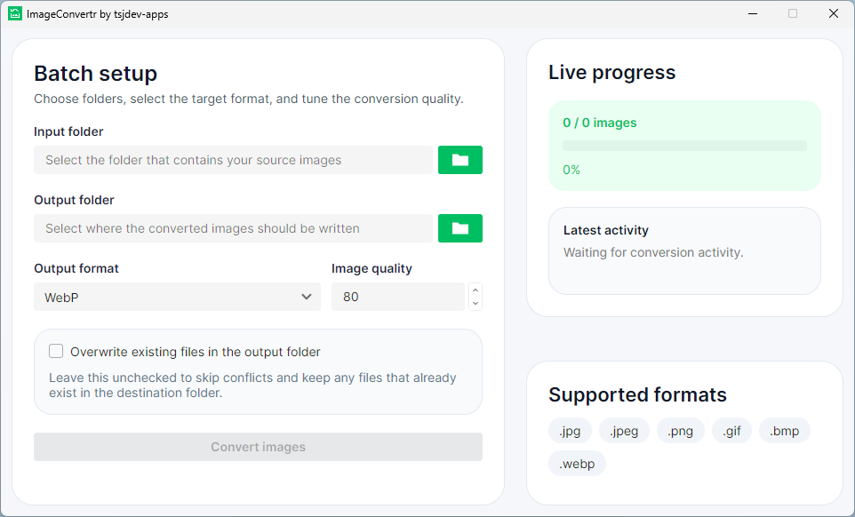
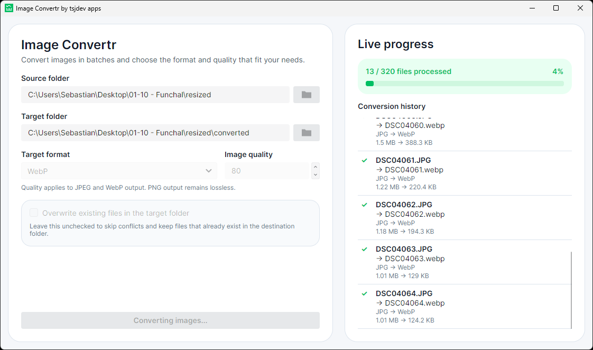
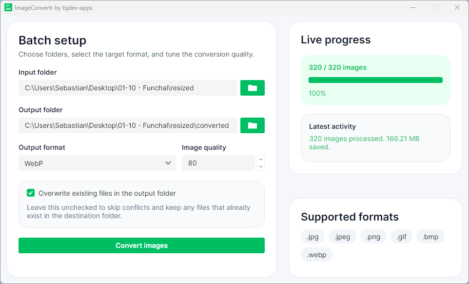

# Image Convertr

Image Convertr is a cross-platform desktop app for converting entire folders of images without turning the task into a script. Built with Avalonia on .NET, it focuses on a practical batch workflow: choose a source folder, pick an output folder, select the target format, adjust quality, and export converted images with live progress feedback.


The project is aimed at everyday image-conversion jobs such as preparing web-ready assets, creating JPEG or PNG copies, converting batches to WebP, or reducing file sizes before sharing image folders.

## Highlights

- Batch convert supported images from a desktop UI
- Convert output files to `PNG`, `JPEG`, or `WebP`
- Adjust image quality for encoded output formats
- Skip or overwrite existing files in the output folder
- Track progress through live status updates and completion summaries
- Supports `.jpg`, `.jpeg`, `.png`, `.gif`, `.bmp`, and `.webp`

> Note: the current conversion workflow processes files from the selected input folder only. It does not recurse into nested subfolders.

## Screenshots

### Batch setup



The main screen keeps the workflow simple: select an input folder, choose an output folder, pick the target format, adjust quality, and decide whether existing files should be overwritten.

### Live progress during a running batch



While the batch is running, ImageConvertr shows overall progress, the latest file activity, and a clear status message so you can see what the app is doing at a glance.

### Completion summary



After the batch finishes, the same workspace shows the final summary, including processed files and saved space, without forcing you into a separate report view.

## Conversion Workflow

1. Select the folder that contains the source images.
2. Choose where the converted copies should be written.
3. Pick the output format: `PNG`, `JPEG`, or `WebP`.
4. Adjust the image quality slider for the selected conversion.
5. Decide whether to skip or overwrite existing output files.
6. Start the batch and follow the live progress panel.

## Supported Formats

Image Convertr currently accepts the following input file types:

- `.jpg`
- `.jpeg`
- `.png`
- `.gif`
- `.bmp`
- `.webp`

Converted files can be written as:

- `PNG`
- `JPEG`
- `WebP`

## Getting Started

### Prerequisites

- .NET SDK matching the version pinned in `global.json`

### Restore

```bash
dotnet restore ImageConvertr.slnx
```

### Build

```bash
dotnet build ImageConvertr.slnx --configuration Release
```

### Run the desktop app

```bash
dotnet run --project src/ImageConvertr.App/ImageConvertr.App.csproj --configuration Release
```

### Run the tests

```bash
dotnet test ImageConvertr.slnx --configuration Release
```

There is no separate lint command. Repository analyzers and code-style checks run as part of the build.

## Project Structure

- `src/ImageConvertr.App`: Avalonia desktop UI shell
- `src/ImageConvertr.Core`: conversion pipeline, models, and image processing
- `tests/ImageConvertr.Tests`: xUnit tests for the conversion service and format metadata

The solution intentionally keeps the UI thin. Avalonia-specific code lives in the app project, while the conversion workflow, format handling, file handling, and progress reporting live in the core library.

## Tech Stack

- [.NET](https://dotnet.microsoft.com/)
- [Avalonia UI](https://avaloniaui.net/)
- [CommunityToolkit.Mvvm](https://learn.microsoft.com/dotnet/communitytoolkit/mvvm/)
- [SkiaSharp](https://github.com/mono/SkiaSharp)
- [xUnit](https://xunit.net/)

## Quality

The repository includes automated coverage for the batch conversion service and output format metadata. Tests verify conversion behavior, file handling, overwrite rules, unsupported files, GIF input handling, progress reporting, and failure handling.

## License

This project is licensed under the MIT License. See [LICENSE](LICENSE) for details.
